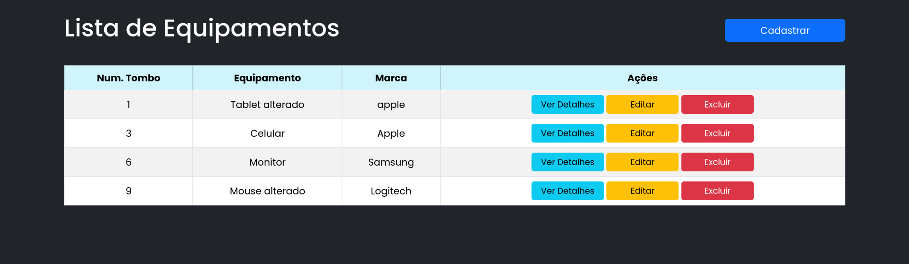
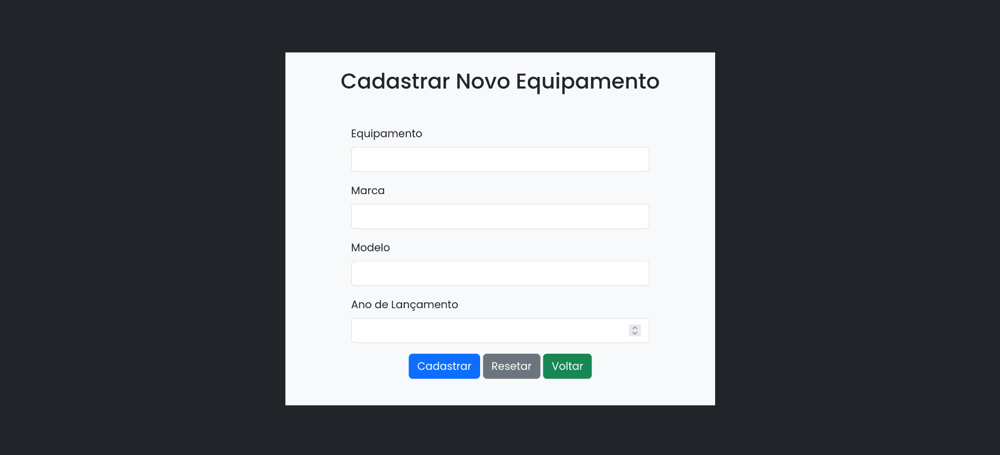
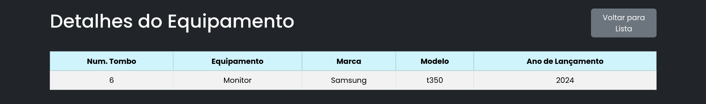
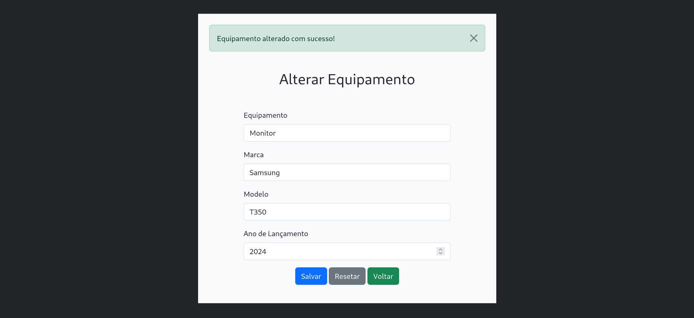
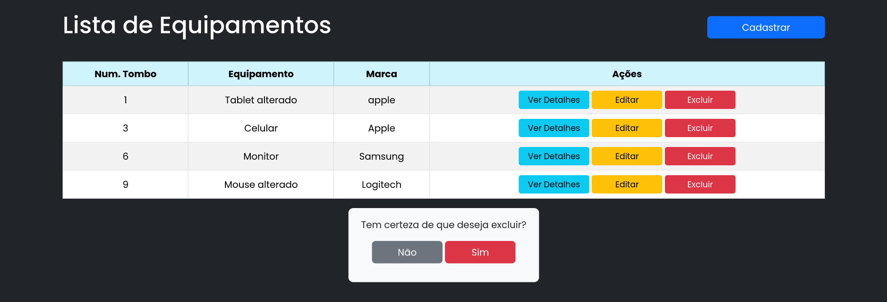
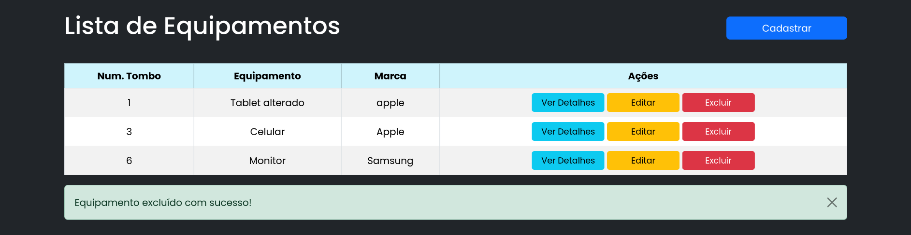

# Managefy

Projeto final do Curso Java Web - Gerenciamento de equipamentos eletrônicos com CRUD e integração com banco de dados e utilizando o padrão MVC.

## Tecnologias
- Java 17
- JSP
- Servlets
- MySQL (8.4.3)
- MySQL Workbench (8.0.4)
- Apache Tomcat (11.0.1)
- JDBC
- Bootstrap (Framework)
- Javascript

## Funcionalidades
- Login de usuários
- Listagem dos equipamentos
- Cadastro de equipamentos
- Editar equipamentos
- Excluir equipamentos
- Ver detalhes

# 1. Login

# 2. Lista de equipamentos

# 3. Cadastrar

# 4. Ver detalhes

# 5. Editar

# 6. Excluir

